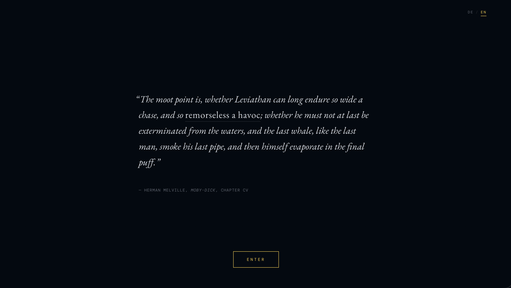
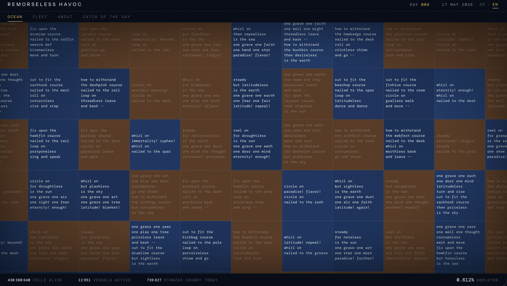
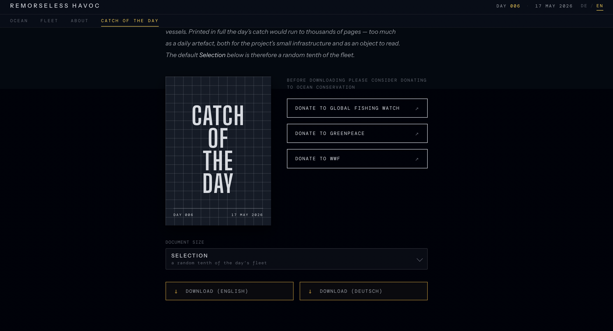

# So Remorseless A Havoc

> An ocean of algorithmically generated poetry, erased in near real time by industrial fishing.

## About

*Remorseless Havoc* is based on an ocean of algorithmically generated language. The stanzas you can see zooming in on the dark tiles in the map, representing the watery regions of our planet, are generated by an algorithm that assembles poetic stanzas from language fragments by Emily Dickinson and Herman Melville. This algorithm can create as many stanzas as there are "fish in the sea", according to Nick Montfort and Stephanie Strickland, who originally developed it for their digital literary work [*Sea and Spar Between*](https://nickm.com/collab/montfort_strickland/sea_and_spar_between/).

*Remorseless Havoc* takes the metaphor literally and transfers the stanzas into a grid spanning the entire globe. Each cell of this grid represents an area of about one square kilometre (1.1 × 1.1 km at the equatorial meridian). This results in roughly **460 million cells and just as many stanzas**, distributed across the world's oceans. Gradually, the stanzas are then deleted by the program based on the movement data of industrial fishing vessels.

The movement data comes from [*Global Fishing Watch*](https://globalfishingwatch.org/). There, the transponder signals of vessels above a certain tonnage are analysed using a machine-learning algorithm that recognises characteristic turning manoeuvres, changes in speed, and dwell-time patterns. In this way, GFW identifies fishing activity and calculates it in hours per vessel together with the GPS position. The *Remorseless Havoc* algorithm then erases verses from the ocean for each hour, in near real time — GFW requires about 72 hours to process the satellite data. One day, all verses will be removed from the sea. The language used in this work is as finite as the ocean's resources.

The project will run until the poetic ocean is empty, which is expected to happen around the year 2030. Then one final poem will remain — in a place, at a time, and with words shaped by the uncertainties of the exploitation of the seas. It will be the Leviathan's last breath, so to speak, about which Herman Melville had already contemplated in Chapter CV of *Moby-Dick* as the result of the systematic hunting of sea creatures:

> "The moot point is, whether Leviathan can long endure so wide a chase, and so remorseless a havoc; whether he must not at last be exterminated from the waters, and the last whale, like the last man, smoke his last pipe, and then himself evaporate in the final puff."

## Views

### Map

The world ocean as a depletion grid in three shades — intact, partially depleted, fully depleted. Yellow dots mark the industrial fishing vessels active that day.

### Stanzas in the grid

Zoom in and each ocean cell reveals the stanza assigned to it. Faded tiles have already been erased; the counters at the bottom track cells alive, vessels active, and stanzas caught today.

### Catch of the Day

Each vessel compiles the stanzas it collected from the ocean on a given day into a poem, arranged from greatest to least lexical diversity. Download a random tenth of the fleet's catch as a PDF poetry volume — and consider donating to ocean conservation while you're at it.

## How it works

1. **Stanzas are generated procedurally** from a port of *Sea and Spar Between* (Montfort & Strickland, 2010), assembled from Dickinson and Melville fragments. Each cell's stanza is deterministic by its coordinate `(i, j)`.
2. **A 0.01° × 0.01° grid spans the planet.** A land mask removes everything that is not ocean, leaving about 460 million water cells — one stanza per cell.
3. **Every day the backend pulls fishing-hour data** from Global Fishing Watch and erases stanzas accordingly — about 3.4 per vessel-hour. The map renders the result at a coarser 10 × 10 km tile resolution; the full stanza grid is only consulted when a fishing event deletes from it.

## Project structure

| Folder        | What's in it                                                | Docs                                          |
| ------------- | ----------------------------------------------------------- | --------------------------------------------- |
| `website/`    | Static frontend (vanilla HTML/JS, canvas renderer)          | [website/README.md](website/README.md)        |
| `backend/`    | FastAPI service, daily depletion scheduler, PDF rendering   | [backend/README.md](backend/README.md)        |
| `generation/` | Lattice mapping, land-mask generation, depletion math       | [generation/README.md](generation/README.md)  |
| `archive/`    | Concept drafts, research notes, screenshots                 | —                                             |

## Live

- Website: [remorselesshavoc.com](https://remorselesshavoc.com)
- Backend API: [remorseless-havoc-production.up.railway.app](https://remorseless-havoc-production.up.railway.app)

## Credits & sources

- **Stanza generator** — port of [*Sea and Spar Between*](https://nickm.com/collab/montfort_strickland/sea_and_spar_between/) by Nick Montfort & Stephanie Strickland (2010), BSD-licensed; source language by Emily Dickinson and Herman Melville.
- **Fishing activity data** — [Global Fishing Watch](https://globalfishingwatch.org/) (AIS signals + machine-learning vessel-behaviour analysis).
- **Title** — Herman Melville, *Moby-Dick*, Chapter CV.

## Author

[Simon Roloff](https://roloffsimon.com), 2026.
